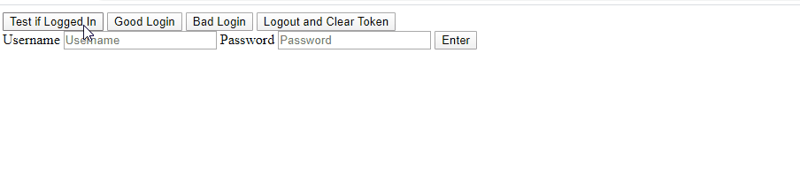

# Aplicación simple de ejemplo con JWT, AJAX y PHP
> Autor : Fernando Calmet  
https://github.com/fernandocalmet  
----------

Este ejemplo muestra el uso de JSON Web Token (JWT) usando un una pagina simple con HTML y AJAX. El cual mediante un ejemplo con botones o formulario, puede enviar o verificar si el usuario es autenticado en el lado del servidor. Este ejemplo no incluye una implementación con una base de datos, sin embargo muestra con datos simples la validación de estos.

Los datos para probar la validación del usuario son:  
- Username: fernando  
- Password: 12345678

## Depedencies
- Firebase PHP JWT  

## Demo

## BUY ME A COFFEE :-)
